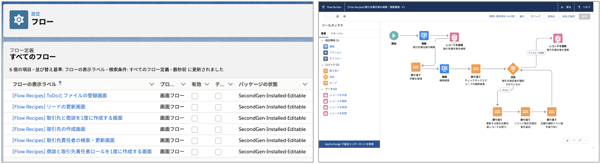

# Lightning Flow Recipes

**Webサイト [https://shunkosa.github.io/lightning-flow-recipes-jp/](https://shunkosa.github.io/lightning-flow-recipes-jp/)**

インストールしてすぐに使用できる Lightning フローのサンプル集です。インストールしたフローは、編集または別名で保存することができます。フローが初めての方は、先に [Trailhead の Flow Builder を使用したフローの作成](https://trailhead.salesforce.com/ja/content/learn/trails/build-flows-with-flow-builder) に取り組んでみてください。
