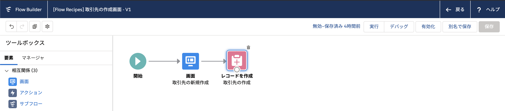
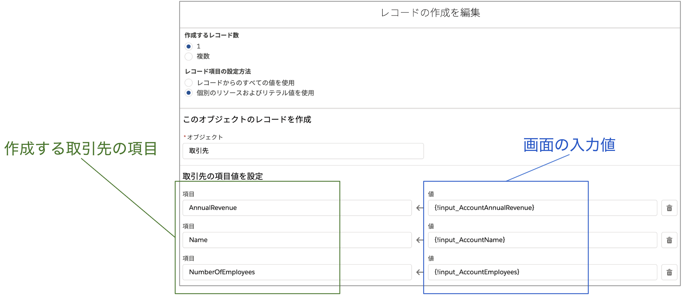
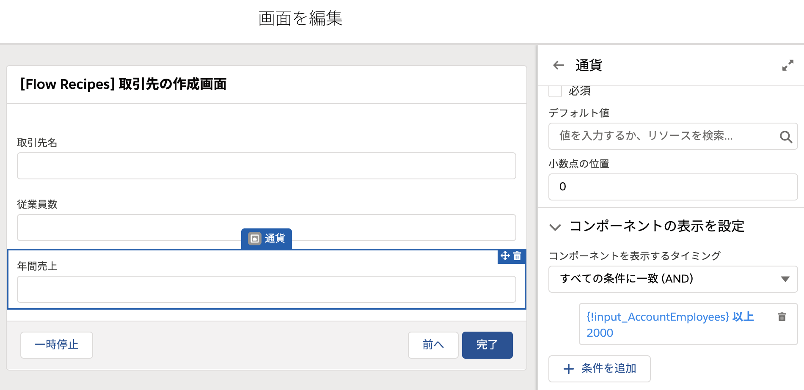
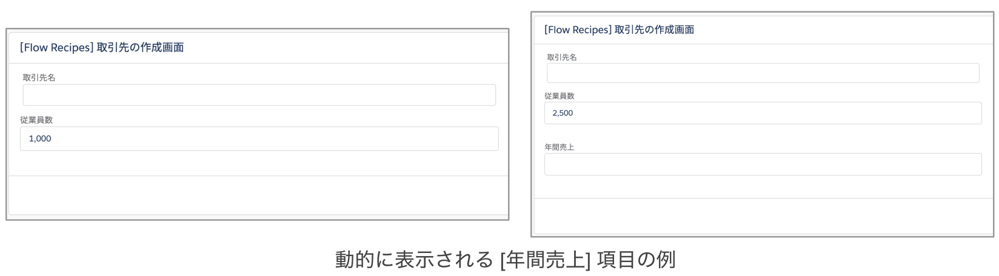

取引先を新規作成するシンプルな画面フローです。

## 使い方
フローを有効化後、このフローを使用してクイックアクションを新規作成するか、任意の Lightning ページにフローを直接配置して使用することができます。フロービルダーを開いて [デバッグ] から起動することも可能です。

## ポイント
### レコードの作成
フローでレコードを処理するには、1. 項目値を個別にセットする (`個別のリソースおよびリテラル値を使用`)方法と、2. レコード変数・レコードコレクション変数を使用する (`レコードからのすべての値を使用`) 方法があります。このフローでは前者の、項目値を個別にセットする方法を使用しています。

レコード変数は、オブジェクトの複数の項目とそれらの値を1つのかたまりとして管理します。Excel に例えると、項目値を個別セットする方法は、セルに1つずつ値を入力すること、レコード変数は1行そのもの管理するイメージです。レコード変数を用いても結局各項目の値を参照したり値を設定することになりますが、複数のレコードを管理したり、レコードを検索し取得する場合は、レコード変数を用いるため、それをそのまま更新する場合は、個別セットよりもレコード変数を用いた方が処理がしやすいです。

このフローで、新たにレコード変数を定義し、[割り当て] 要素で値をセットしてからそのレコード変数でレコードを作成することもできます。ぜひ試してみてください。また、[リードの更新](../lead_update_screen) フローでも、レコード変数を用いた比較的シンプルな画面フローを定義しています。こちらも参照してください。

### 画面要素の動的な表示切り替え

各画面要素の [コンポーネントの表示を設定] セクションでコンポーネントを表示するタイミングを設定することができます。このフローでは、[年間売上] は、[従業員数] が2000以上のときのみ表示される例を実装しています。

必要な項目だけを画面に表示することができるため、画面がシンプルになります。ぜひ実際のフローでも使えるシーンがないか確認してみてください。