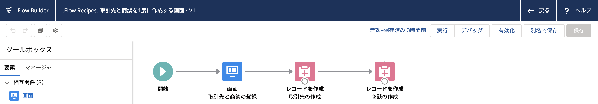
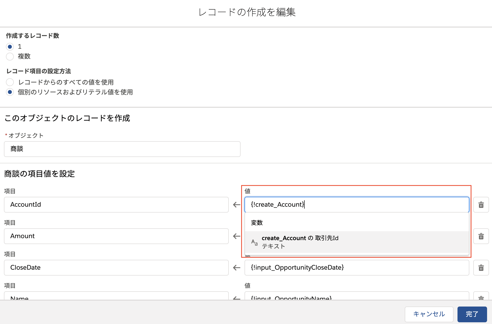

# 取引先と商談を1度に作成する画面
取引先と商談を1画面の入力内容から作成するフローです。

## ポイント
### リレーションのあるレコードの作成

リレーションのあるレコードを作成する場合は、標準の画面から作成する場合と同様に、先に親オブジェクトのレコードを作成します。このフローでは、先に取引先を作成し続けて商談を作成します。

[レコードの作成] 要素から、作成されたレコードの Id を変数として使用できます。このフローでは、商談の取引先 ID (`AccountId`) に対して、「取引先の作成」要素から生まれた 取引先 ID を割り当てています。これにより、作成される商談は、直前に作成された取引先を参照します。
