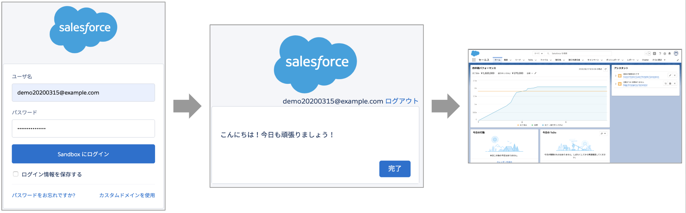
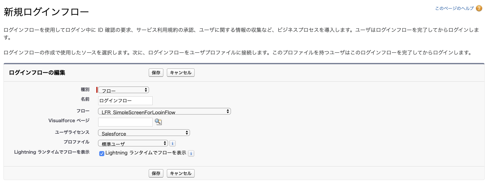

ログインフローの例です。

## 使い方
1. 「ログインフロー用のサンプル画面」フローを有効化します。
2. [設定] - [ログインフロー] から、新しくログインフローを設定します。有効化したフローを選択してください。

## ポイント
### ログインフローについて
上記スクリーンショットの通り、ログインフローは、ログイン画面から Salesforce のアプリケーションに遷移する前に起動できるフローです。主なユースケースは、ログイン時のアナウンスや情報収集、高度な認証プロセスの実装等です。詳細は [Salesforce Help - カスタムログインフロー](https://help.salesforce.com/articleView?id=security_login_flow.htm&type=5) を参照してください。

### 設定時に気をつけること
ログインフローの最中にエラーになるとログインできなくなる可能性がありますので、ログインフローで使用するフローは入念にテストしてください。また、万が一のために、リリース前にログインフローを解除できるユーザを用意しておきましょう。(例: システム管理者にはログインフローを設定しないか、設定にアクセスできログインフローが割り当たっていないプロファイルを用意しておく)