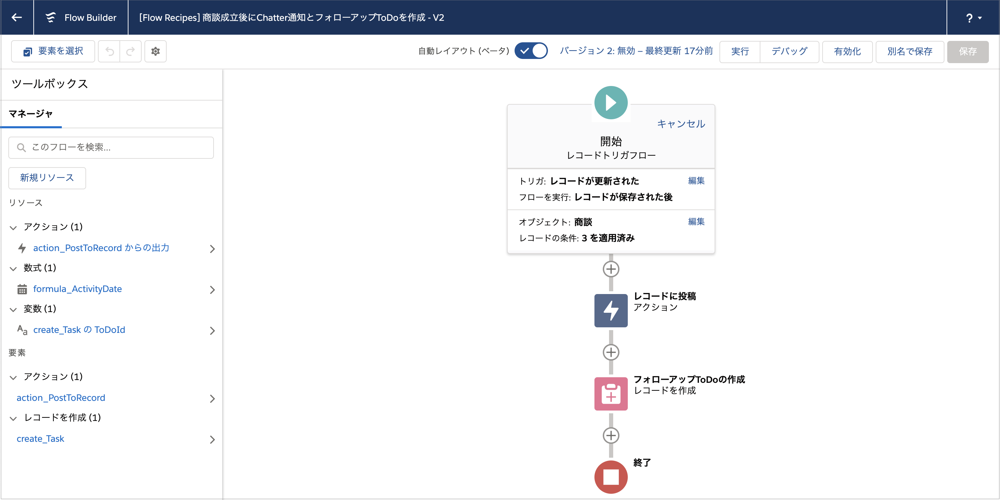
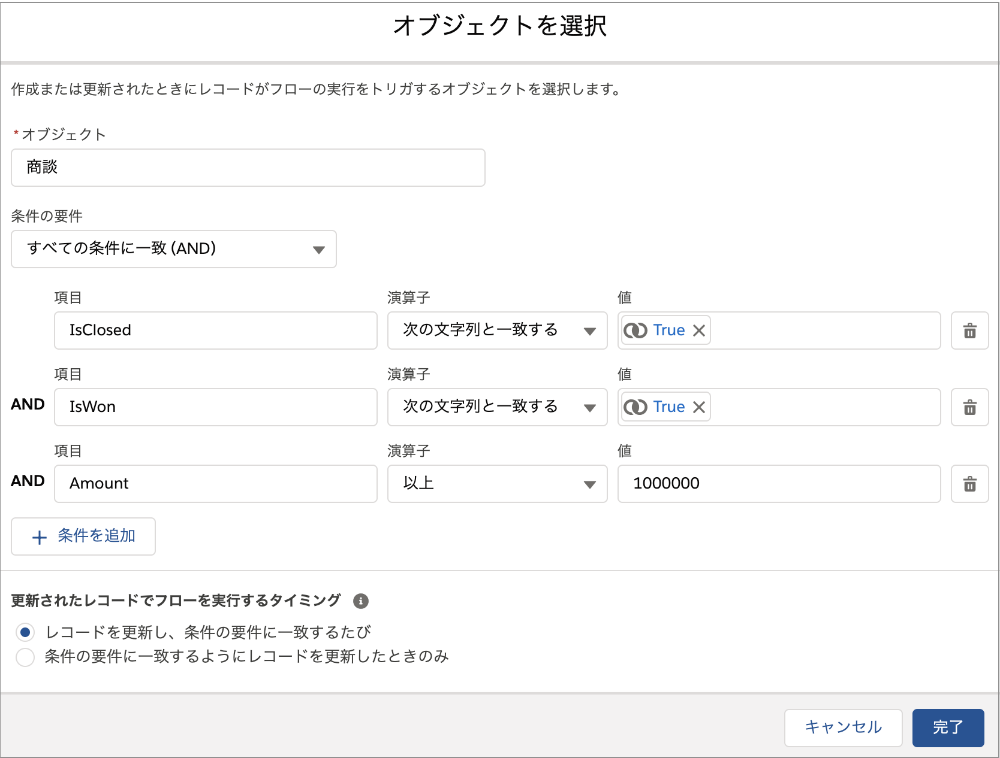
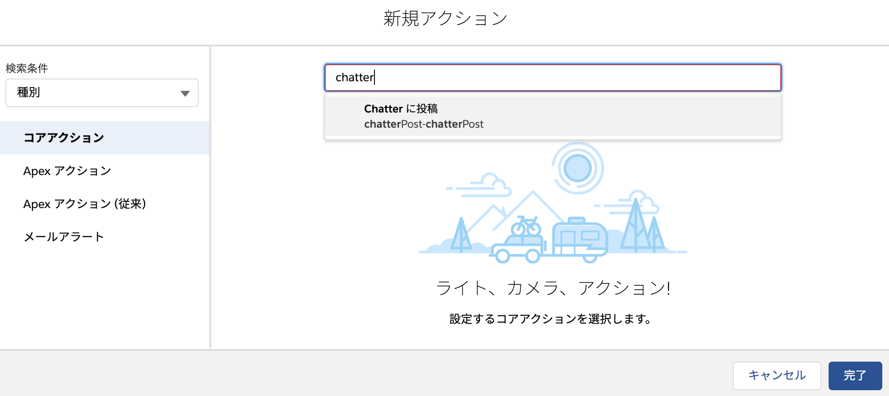
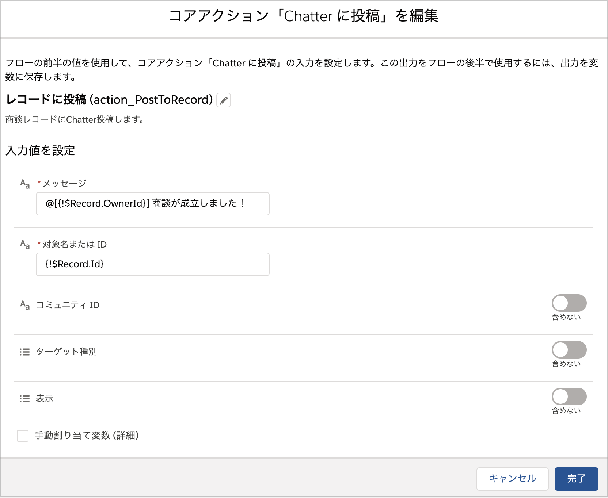

## 使い方
フローを有効化し、金額が 1,000,000 円以上の商談を成立させると、そのレコードに Chatter 投稿され、ToDo が作成されます。

## ポイント
### レコードトリガフロー
レコードトリガーフローを用いると、ワークフロールールやプロセスビルダーのようにレコードの作成・変更を契機に処理を実行することができます。レコードトリガフローの特徴は、将来の機能追加が期待されていること、プロセスよりも処理が高速であること、削除を契機に処理が実行できたり、関連レコード以外のレコードも扱えるなど、高度な処理が実現できるところです。プロセスビルダーとの比較については、『[レコードトリガフローの考慮事項](../unsupported-features)』も参照してください。

レコードトリガフローの開始要素では、プロセスビルダーと同様に、起動する条件やオブジェクトを選択できますが、この時点でオブジェクトのレコードを絞り込むこともできます。このフローでは、金額が 1,000,000 以上かつ成立している商談が対象であるため、ここで商談を絞り込むとフローがシンプルになります。ただし、開始要素での絞り込みには数式項目が利用できませんので注意してください。(この場合は通常通り[レコードを取得]要素を使用します。)

### Chatter 投稿

フローから Chatter 投稿を行うには、[アクション] 要素で [Chatter に投稿] を選択します。

このアクションの必須項目は、[メッセージ] と [対象名または ID] の2つです。

[メッセージ] は Chatter 投稿の本文です。
メンションする場合は、`@[0051m000000Zw7]` のように記載します。ユーザ ID は ID を直接指定するのではなく、変数にすることもできます。このフローでは、`@[{!$Record.OwnerId}] 商談が成立しました！` というメッセージを設定して、対象の商談の所有者 (OwnerId) にメンションする設定になっています。ロングテキストや数式を利用する場合は、直接入力ではなく、テキストテンプレートを作成し、このアクションから参照すると良いでしょう。

[対象名または ID] はどのレコードに対して Chatter 投稿するかを指定します。レコード ID を指定するか、ユーザ名やChatter グループ名を指定することもできます。ユーザ名を設定した場合は、[ターゲット種別] の項目に `User` を設定し、Chatter グループ名を指定した場合は、[ターゲット種別] の項目に `Group` を設定してください。詳細は [Help 記事の フローコアアクション - Chatter に投稿](https://help.salesforce.com/articleView?id=flow_ref_elements_actions_chatter.htm&type=5) を参照してください。