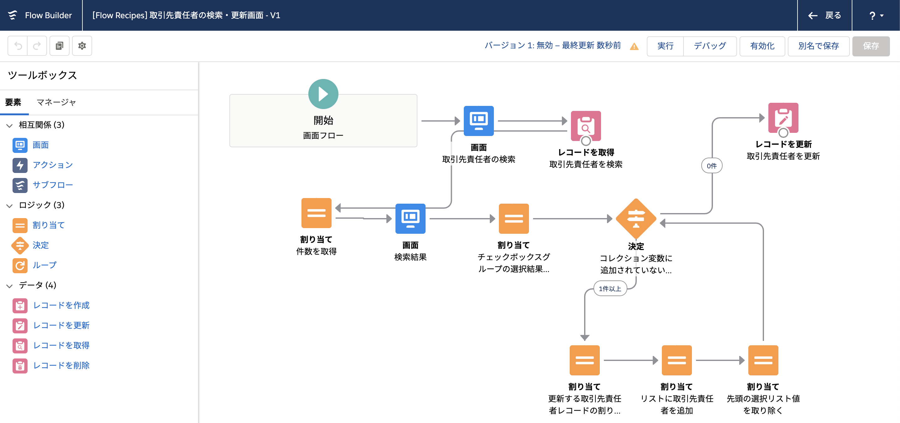
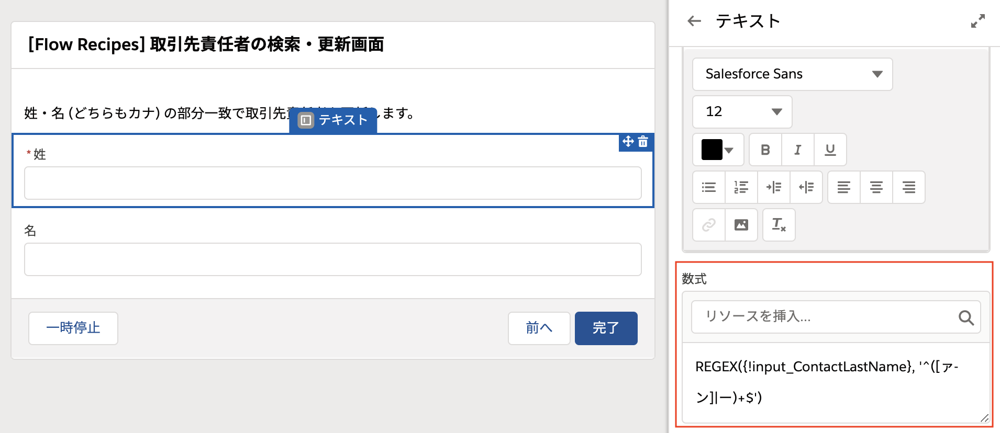
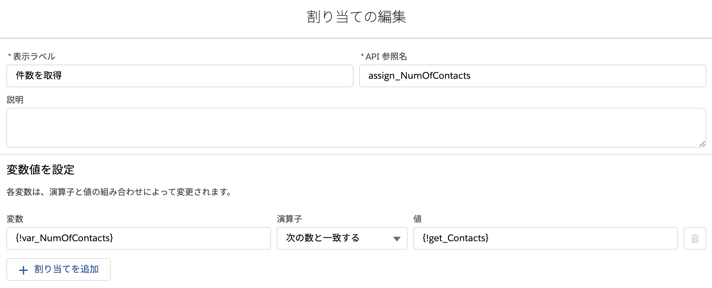

取引先責任者を名前で検索し、検索した取引先責任者のうちから、対象となるレコードを選択し、その取引先と説明欄を一括更新する画面フローです。

## ポイント
### 画面要素に入力チェックを適用する
フローでは、姓・名を全角カナのみに制限しています。画面要素の [入力を検証] セクションから入力チェックを適用できます。

使い方は通常の入力規則と同様です。REGEX 関数のサンプルについては、[「Salesforce Help - 一般的なREGEX関数を用いた正規表現の検証」](https://help.salesforce.com/articleView?id=000334073&language=ja&type=1&mode=1) や、[「Qiita - form用正規表現判定/備忘」](https://qiita.com/fubarworld2/items/9da655df4d6d69750c06) 等を参考にしてください。

### コレクション変数のサイズ (件数) を取得する
コレクション変数のサイズを取得するには、数値型の変数を作成し、コレクション変数を割り当てます。これで数値型の変数に自動的にコレクション変数のサイズが割り当てられます。

例えば、[レコードを取得] の結果であるコレクション変数 `get_Contacts` に取引先責任者が10件含まれている場合、変数 `var_NumOfContacts` の値は10になります。

### 複数選択リスト (チェックボックスグループ) の選択結果を取得する
通常、選択リストで選択された結果を保存するには、[レコード選択肢セット] や [選択リスト選択肢セット] の最後のセクションにある [項目値をさらに保存] を用いますが、これは最後に選択された値しか取得できませんので、複数選択リストやチェックボックスグループの場合は少し工夫が必要です。

複数選択リストやチェックボックスグループの選択結果は、画面要素に `; ` 区切りで1つの長いテキストとして保存されます。このフローではチェックボックスグループで検索した取引先責任者から更新対象を選択しますが、例えば3件の取引先責任者を選択した場合、`input_Contacts` の中身は、`0031k00000TI6KEAA1; 0031k00000TI6KEBB2; 0031k00000TI6KECC3` のようになります。この長い文字列はこのままでは使えませんので、順番に`;` 区切りの Id を取り出す必要があります。数式 `formula_NextPicklistValue` `formula_RemainingPicklistValues` はそれぞれ、この長いテキストから先頭の Id と残りの文字列を切り取ったものです。最初に `input_Contacts` の中身を別のテキスト変数 (`var_SelectedContactIds`) にコピーして、Id を 1つ取りだしながら、取り出した Id を削っていきます。つまり、フローのループでは次のように値が変化していきます。

<table>
    <tr>
        <th nowrap>ループ回数</th>
        <th>var_SelectedContactIds</th>
        <th>formula_NextPicklistValue (先頭の値)</th>
        <th>formula_RemainingPicklistValues (残った値)</th>
    </tr>
    <tr>
        <td>1回目</td>
        <td nowrap>0031k00000TI6KEAA1; 0031k00000TI6KEBB2; 0031k00000TI6KECC3</td>
        <td>0031k00000TI6KEAA1</td>
        <td nowrap>0031k00000TI6KEBB2; 0031k00000TI6KECC3</td>
    </tr>
    <tr>
        <td>2回目</td>
        <td nowrap>00031k00000TI6KEBB2; 0031k00000TI6KECC3</td>
        <td nowrap>00031k00000TI6KEBB2</td>
        <td nowrap>0031k00000TI6KECC3</td>
    </tr>
    <tr>
        <td>3回目</td>
        <td>0031k00000TI6KECC3</td>
        <td>0031k00000TI6KECC3</td>
        <td></td>
    </tr>
</table>

ループ内では合わせて、レコード変数への値の割り当てと、コレクション変数へのレコード変数の追加も行っていますので、ループが終わった時点では、選択された3件のレコード変数が、コレクション変数に追加されています。レコードの更新処理では、このコレクション変数を渡すだけで更新処理が完了します。
