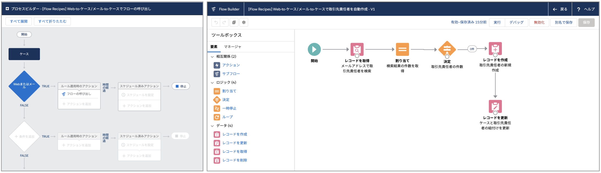

# Web-to-ケース/メール-to-ケースで取引先責任者を自動作成

Web-to-ケースまたはメール-to-ケースでケースを作成した場合、メールアドレスで取引先責任者が検索され、自動で紐付けされます。(参考: [Salesforce Help - ケース登録時の関連付けについて](https://help.salesforce.com/apex/HTViewSolution?id=000182096&language=ja))
ただし、取引先責任者が見つからなかった場合は何も起こりません。このフローは、メールアドレスで取引先責任者を検索し、見つからなかった場合に取引先責任者を自動作成して紐付けします。

## 使い方
1. Web-to-ケースまたはメール-to-ケースを組織で有効化します。
2. プロセスとフローをそれぞれ有効化します。
3. 取引先責任者のメールアドレスとして組織にレコードが存在しないメールアドレスを使用して、Web−to-ケースまたはメール-to-ケースでケースを作成します。
4. 作成されたケースに、新規作成された取引先責任者が紐付いていることを確認します。
