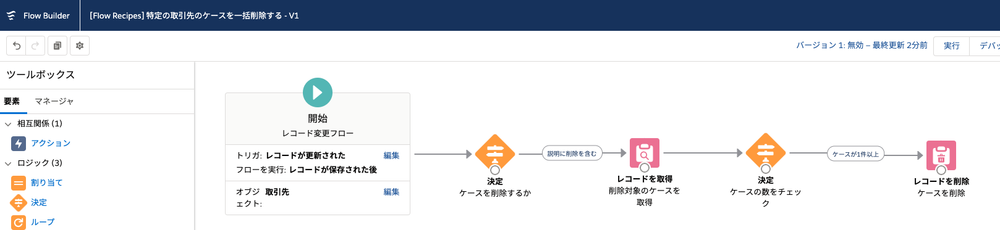

取引先の説明欄に「削除」という単語が含まれている場合、その取引先のケースをすべて削除します。これはレコード変更フローの仕組みや [レコードを削除] 要素の使い方を理解するためのサンプルフローです。

## 使い方
1. フローを有効化します。
2. 関連ケースが 1 つ以上ある取引先の説明欄に「削除」という単語を含めます。
3. 関連ケースが削除されることを確認します。

## ポイント
### レコードの削除
レコードを削除する際にコレクション変数を使用する場合は、そのコレクション変数にレコードがあること、含まれているレコードの `Id` 項目に値があることを確認してください。今回のサンプルフローは、更新時のみ起動するため、`Id` には必ず値があり、コレクション変数にレコードが含まれているかどうかだけを確認しています。