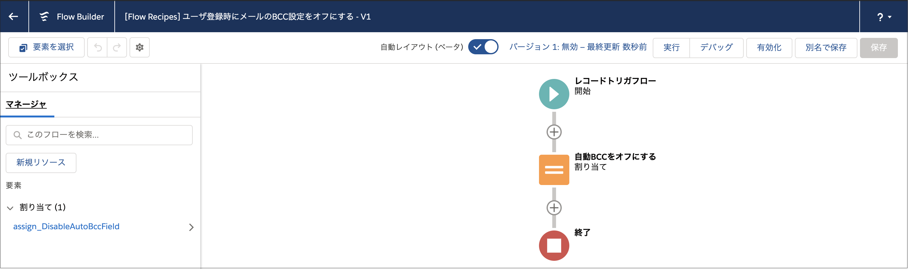
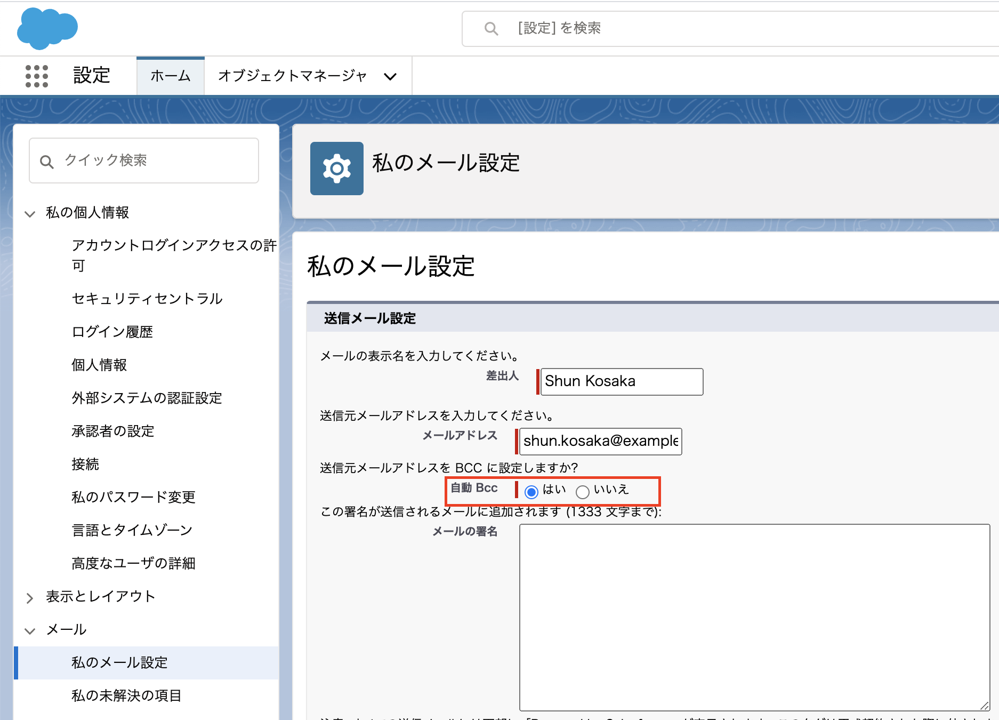

ユーザ登録時にメールのBCC設定をオフにするためのレコードトリガフロー(保存前フロー)です。

この項目はデフォルトでONになっていますが、このフローを有効化すると、登録時にOFFに設定されます。

## ポイント
* 保存前フローの基本的な内容については、『[取引先の請求先住所を納入先住所に自動コピー](../sync-account-billing-address-to-shipping-address)』も合わせて確認してください。
* 同様の機能はプロセスビルダーや保存後フローでも実装できますが、実現したい処理が同じオブジェクトを更新するだけであれば、保存前フローの方が作りがシンプルになり、処理も高速です。