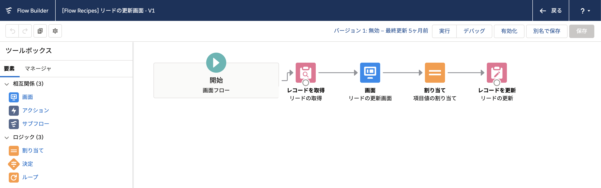
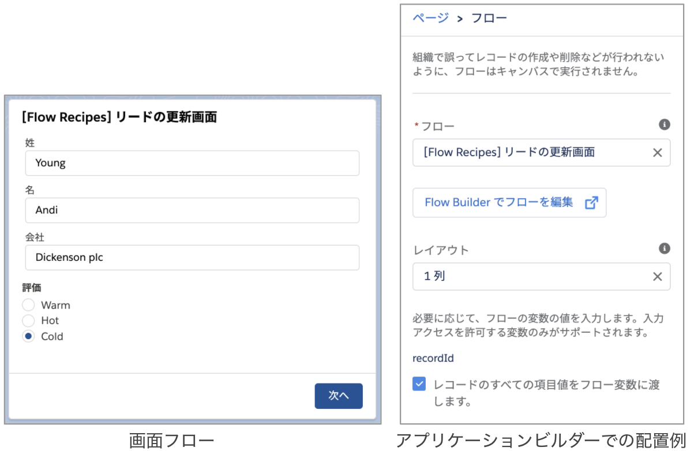
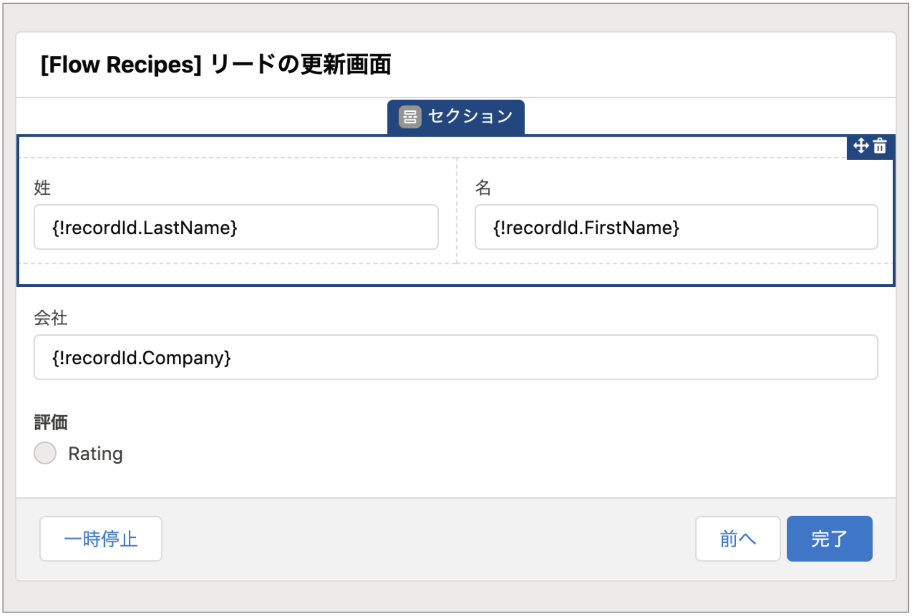

リードを更新するシンプルな画面フローです。

## 使い方
フローを有効化後、このフローを使用してリードのクイックアクションを新規作成するか、リードの Lightning ページにフローを直接配置して使用することができます。

## ポイント
###  Lightning ページやアクションからレコードを取得
現在開いているレコード Id をフロー内で取得するには [入力] にチェックの入った `recordId` という名前の**レコード型の変数**を用います。これまで、`recordId` は通常テキスト型の項目を用いて、フロー内で [レコードを取得] 要素を用いてレコード情報を取得していました。Summer '20 以降は、レコード型の変数を用いると、フロー内でレコードを取得し直す必要がなくなります。Lightning レコードページでフローを配置する際は、[レコードのすべての項目値をフロー変数に渡します] にチェックを入れてください。

### 横並びの画面配置

画面フローで入力要素を横並びにするには、[セクション] を使用します。

## 選択リストを表示する

オブジェクトの選択リスト項目の選択肢を使用するには、[選択リスト選択肢セット] を作成して、画面フロー内の要素から呼び出します。このフローでは、リードの評価項目を更新するために、`options_LeadRating` というリードの選択リスト選択肢セットを作成し、ラジオボタン要素から呼び出しています。

※Summer '21 ベータ版の機能でオブジェクト項目をそのまま利用する機能がありますが、このフローでは 1 つずつ画面項目に合わせた変数を明示的に作成しています。
### レコードの更新
レコードを更新する際は、[取引先の作成画面](../account-create-screen) のレコードの作成と同様に、個別に値を設定する方法と、レコード変数を使用する方法の 2 通りがあります。ここでは、一例としてレコード変数 `recordId` に値を割り当てた後、[レコードの更新] 要素でこのレコード変数を参照しています。個別に値を設定する方法でも更新できます。ぜひ試してみてください。