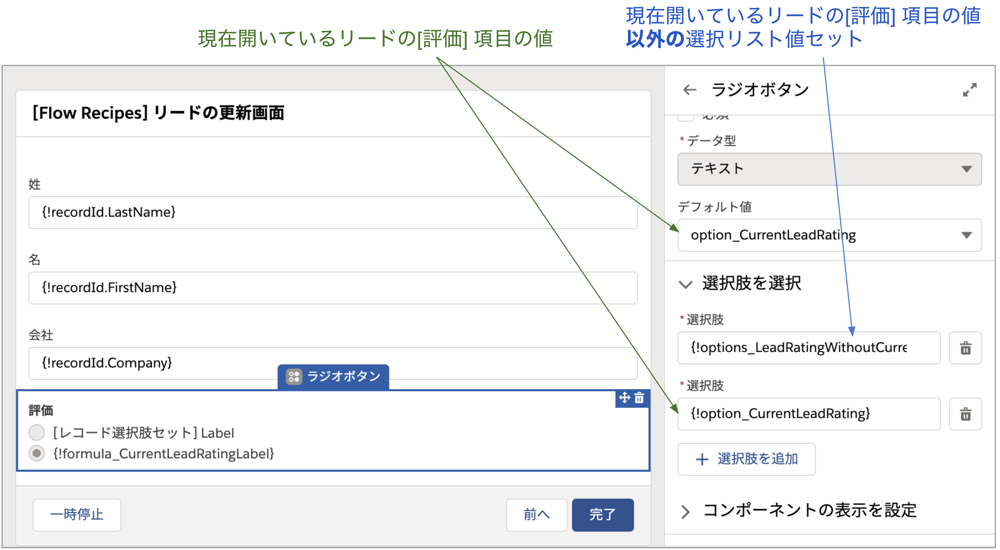
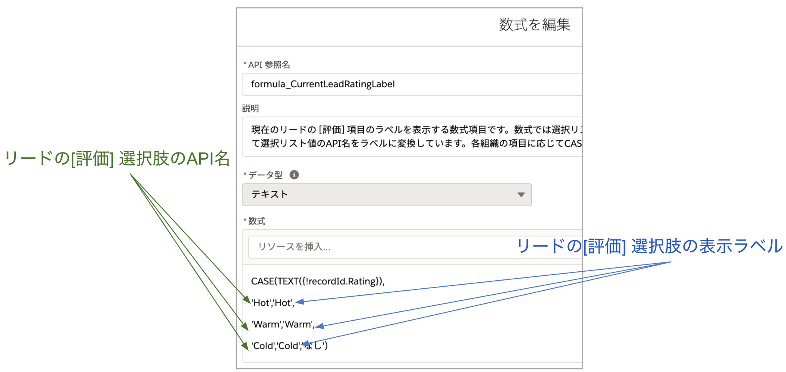

リードを更新するシンプルな画面フローです。

## 使い方
フローを有効化後、このフローを使用してリードのクイックアクションを新規作成するか、リードの Lightning ページにフローを直接配置して使用することができます。デバッグする場合は `recordId` に任意のリードのレコード選択して試してください。

## ポイント
###  Lightning ページやアクションからレコードを取得
現在開いているレコード Id をフロー内で取得するには [入力] にチェックの入った `recordId` という名前の**レコード型の変数**を用います。これまで、`recordId` は通常テキスト型の項目を用いて、フロー内で [レコードを取得] 要素を用いてレコード情報を取得していました。Summer '20 以降は、レコード型の変数を用いると、フロー内でレコードを取得し直す必要がなくなります。Lightning レコードページでフローを配置する際は、[レコードのすべての項目値をフロー変数に渡します] にチェックを入れてください。

### 選択リストのデフォルト値
選択リストやラジオボタンで、現在開いているレコードの選択肢の値をデフォルト値に設定するには少し工夫が必要です。通常、オブジェクトの選択リスト項目を画面フローで使用する場合は、[選択リスト選択肢セット] を使用しますが、これ単独では現在開いているレコードの選択リスト値をデフォルト値として使用することができません。そこで、[レコード選択肢セット] を使用し、`PicklistValueInfo` オブジェクトから、現在開いている値以外の選択リスト値を取得します。加えて、現在開いているレコードの選択リスト値を個別の選択肢として作成し、これらを組み合わせます。

数式 `formula_CurrentLeadRatingLabel` で表現している選択リスト値の表示ラベルは、環境に合わせて修正してください。

### レコードの更新
レコードを更新する際は、[取引先の作成画面](../account-create-screen) のレコードの作成と同様に、個別に値を設定する方法と、レコード変数を使用する方法の 2 通りがあります。ここでは、一例としてレコード変数 `recordId` に値を割り当てた後、[レコードの更新] 要素でこのレコード変数を参照しています。個別に値を設定する方法でも更新できます。ぜひ試してみてください。