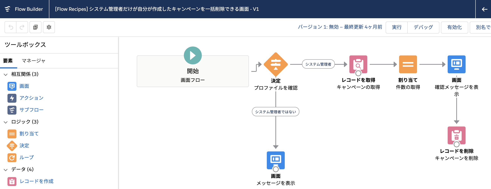
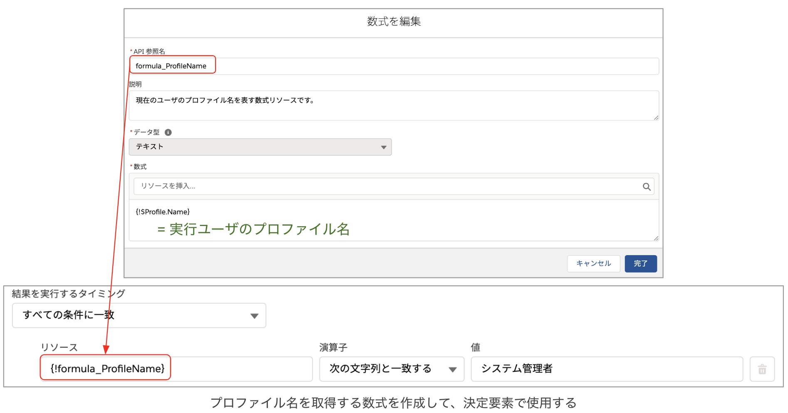
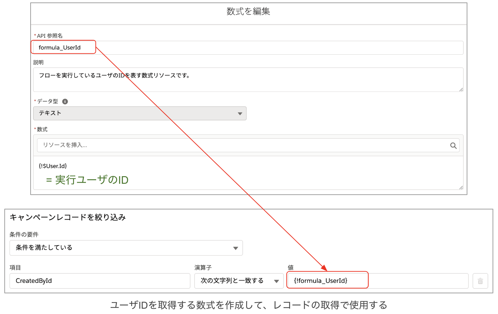

ユーザの情報を取得するフローのサンプルです。

## ポイント
### フローを実行しているユーザの情報を取得する
プロファイルやロールによって分岐を入れたい、実行ユーザが所有者のレコードを取得したい等、フロー内で実行ユーザの情報を取得するには、**数式リソースを作成しグローバル変数を参照**します。このフローでは、実行ユーザのプロファイル名を取得するために `$Profile.Name`、実行ユーザの ID を取得するために `$User.Id` を使用しています。

数式で利用可能なグローバル変数については、実際にフローの設定画面内でリソースを参照するか、[Salesforce Help | フローのリソース: グローバル変数](https://help.salesforce.com/articleView?id=flow_ref_resources_global_variables.htm&type=5) を参照してください。