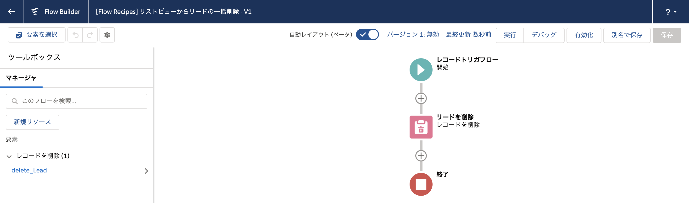
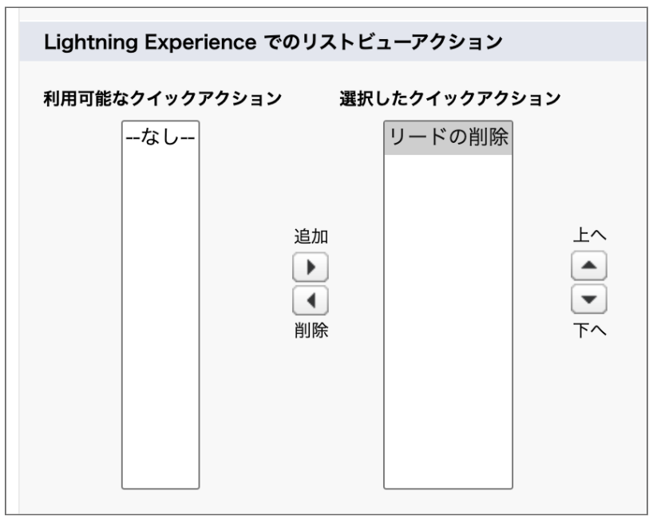

リストビューからリードを一括削除するためのレコードトリガフローです。一括クイックアクション(リストビューの検索レイアウトで配置するクイックアクション)と併用します。

## 使い方
1. フローを有効化します。
2. [オブジェクトマネージャ] > [リード] > [Salesforce Clasic の検索レイアウト] で、[リストビュー] を編集し、[Lightning Experience でのリストビューアクション] セクションで、[リードの削除] を追加します。

3. リストビューから任意のリードをチェックして、[リードの削除] ボタンをクリックします。

## ポイント
リストビューから直接フローを呼び出すことができないため、代わりにレコードの更新をトリガにフローを呼び出しています。また、このフローでは、削除対象のフローを特定するために、カスタムのチェックボックス項目を使用しています。