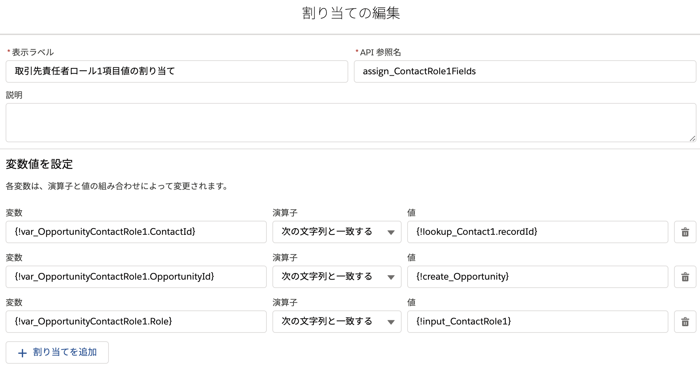

#  商談と取引先責任者ロールを1度に作成する画面
商談と、その商談の取引先責任者のロール(最大2つまで)を1度に登録できる画面フローです。

## ポイント

### ルックアップ 要素

[ルックアップ] 要素は、選択(入力)された レコードの ID と名前を変数として保持します。商談の取引先責任者のロール (OppotunityContactRole オブジェクト) は必須項目に取引先責任者 ID、商談 ID、ロールがありますが、取引先責任者には、ルックアップ要素のレコードID (`lookup_Contact1.recordId` や `lookup_Contact2.recordId` つまり取引先責任者レコードのID)を割り当て、商談 ID には新規作成した商談の ID を、ロールには画面で選択したロールを割り当てています。

### レコードコレクション変数
サンプルのフローのように割り当て要素を使用しなくても、直接 [レコードの作成] 要素を用いれば、取引先責任者ロールのレコードは作成できます。しかし、一般に**同じオブジェクトのレコードを複数登録する場合は、レコードの作成を繰り返し行うのではなく、複数のレコードを1つのコレクション変数にまとめる**と、[レコードの作成] 要素の使用が1回で済むため、**パフォーマンスが良くなり**ます。

