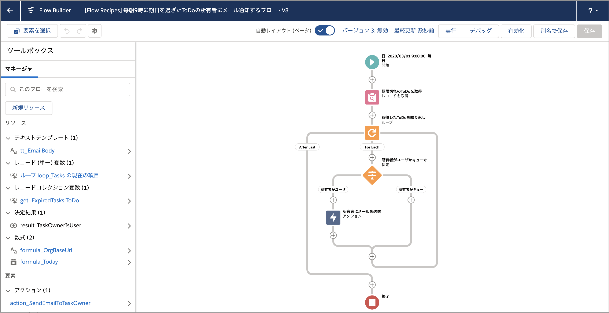
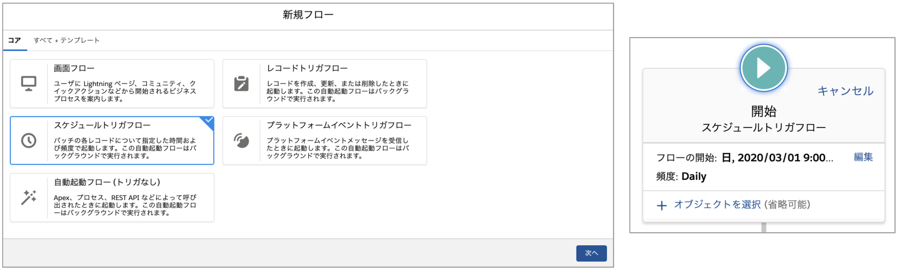

## ポイント
### スケジュールトリガフロー

レポートのスケジューリングのように、決まった時間にフローを定期的に実行させるには、スケジュールトリガフローを使用します。新規フロー作成時に、 [スケジュールトリガフロー] を選択します。

スケジュールトリガフローを選択した場合に、開始要素でオブジェクトやレコードを絞り込むことができますが、ここでの条件には変数が使用できません。つまり、今回のように、完了予定日と本日日付を比較したい場合など、動的な条件を使用してレコードを取得する場合は、別途 [レコードの取得] 要素を使用してください。

### メール送信
メール送信については、『[取引先から取引先責任者に一括メールを送信する画面](../mass-email-to-contacts-screen)』の画面フローにも例があります。Winter '21 時点では、Lightning フローから直接メールテンプレートを参照することはできません。代替として、ワークフローメールアラートはフローからも呼び出し可能であるため、メールアラートを作成するか、『[メール送信用のサードパーティアクション(英語)](https://unofficialsf.com/send-better-email-flow-action/)』を使用する方法があります。このフローでは簡便のためにプレーンテキストのテキストテンプレートを使用しています。