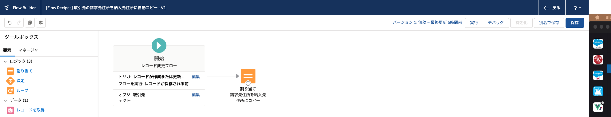
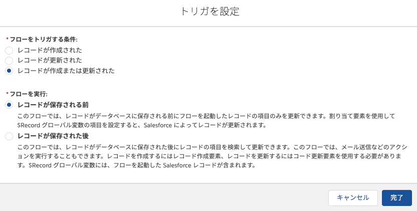
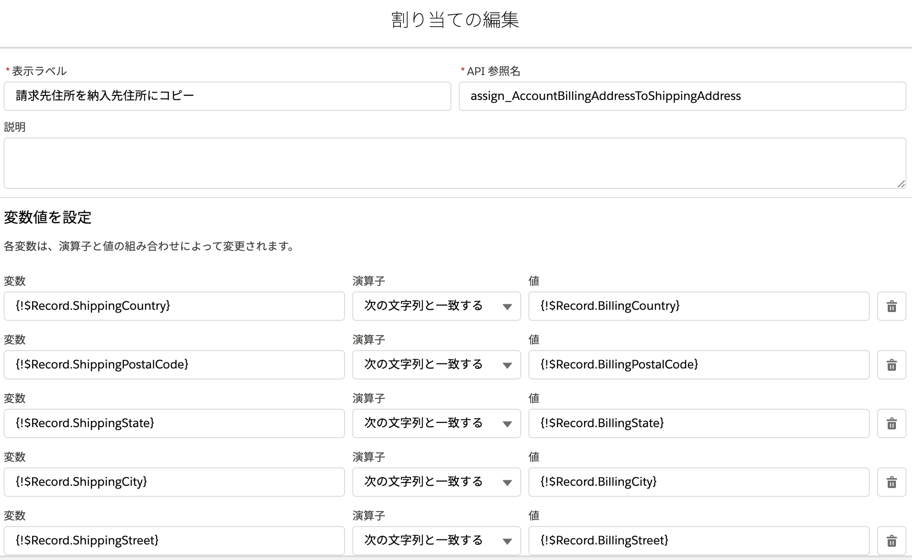

## ポイント
取引先の請求先住所を納入先住所に自動コピーするフローです。

### 保存前フローについて
[Spring '20 で GA となった保存前フロー](https://releasenotes.docs.salesforce.com/ja-jp/spring20/release-notes/rn_forcecom_flow_fbuilder_before_save_updates.htm)はプロセスビルダーと同様に、レコードの作成や更新をきっかけとして起動する自動化プロセスです。プロセスビルダーと比較して処理が高速であることがメリットです。例えば、コンパイルサイズの非常に大きな数式を作成している場合は、このフローに置き換えるとメンテナンスしやすくなる可能性があるでしょう。

保存前フローは、レコード変更フローを作成し、[開始] 要素の [フローを実行] 欄で [レコードが保存される前] を選択することで利用できます。プロセスビルダーとの比較については、『[レコード変更フローの考慮事項](../unsupported-features)』を参照してください。

### 保存前フローの基礎
保存前フローでは、対象のレコードが `$Record` 変数で管理されます。レコードを更新する場合は、[レコードの更新] 要素の代わりに、[割り当て] 要素を使用して、この変数の項目に値を設定します。

### 複合項目の取り扱い

納入先住所や請求先住所は `ShippingAddress`、`BillingAddress` といった項目で管理されますが、これらは複合項目と呼ばれ、**読み取り専用**です。少し手間がかかりますが、値を割り当てる際は、元の項目群 (郵便番号 (`ShippingPostalCode`) や都道府県 (`ShippingState`) など) を個別に扱う必要があります。