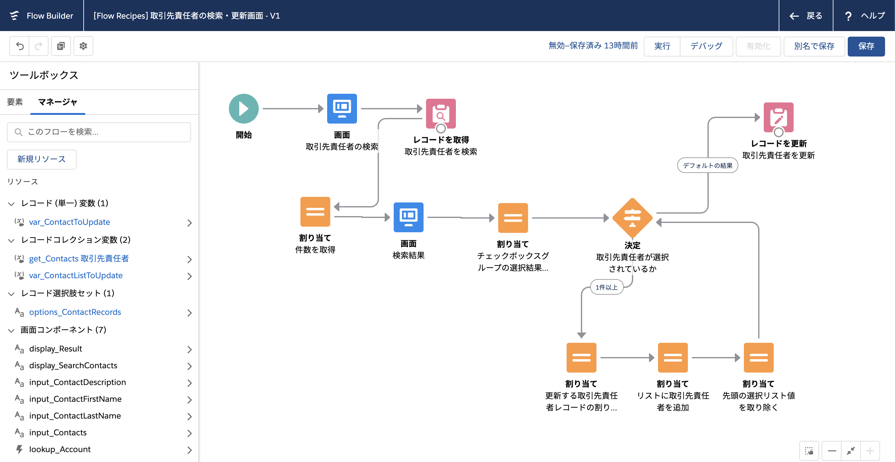
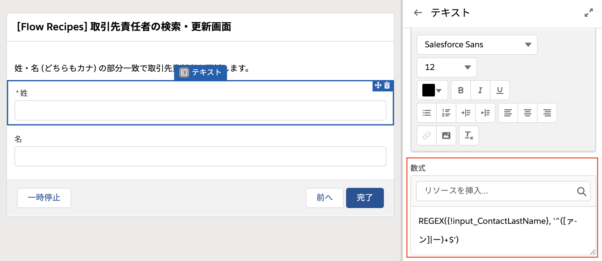

# 取引先責任者の検索・更新画面

## ポイント
### 画面要素に入力チェックを適用する
フローでは、姓・名を全角カナのみに制限しています。画面要素の [入力を検証] セクションから入力チェックを適用できます。

使い方は通常の入力規則と同様です。REGEX 関数のサンプルについては、[「Salesforce Help - 一般的なREGEX関数を用いた正規表現の検証」](https://help.salesforce.com/articleView?id=000334073&language=ja&type=1&mode=1) や、[「Qiita - form用正規表現判定/備忘」](https://qiita.com/fubarworld2/items/9da655df4d6d69750c06) 等を参考にしてください。

### 複数選択リスト (チェックボックスグループ) の選択結果を取得する
通常、選択リストで選択された結果を保存するには、[レコード選択肢セット] や [選択リスト選択肢セット] の最後のセクションにある [項目値をさらに保存] を用いますが、これは最後に選択された値しか取得できませんので、複数選択リストやチェックボックスグループの場合は少し工夫が必要です。複数選択リストやチェックボックスグループの選択結果は、画面要素に `; ` 区切りで1つの長いテキストとして保存されます。このフローではチェックボックスグループで検索した取引先責任者から更新対象を選択しますが、例えば3件の取引先責任者を選択した場合、`input_Contacts` の中身は、`0031k00000TI6KEAA1; 0031k00000TI6KEABC; 0031k00000TI6KEDEF` のようになります。この長い文字列はこのままでは使えませんので、順番に`;` 区切りの Id を取り出す必要があります。数式 `formula_NextPicklistValue` `formula_RemainingPicklistValues` はそれぞれ、この長いテキストから先頭の Id と残りの文字列を切り取ったものです。最初に `input_Contacts` の中身を別のテキスト変数 (`var_SelectedContactIds`) にコピーして、Id を 1つ取りだしながら、取り出した Id を削っていきます。つまり、フローのループでは次のように値が変化していきます。

|ループ回数|var_SelectedContactIds の値| formula_NextPicklistValue の値 (先頭の値)|formula_RemainingPicklistValues の値 (残った値)|
|--|--|--|--|
|1回目|0031k00000TI6KEAA1; 0031k00000TI6KEABC; 0031k00000TI6KEDEF|0031k00000TI6KEAA1|0031k00000TI6KEABC; 0031k00000TI6KEDEF|
|2回目|00031k00000TI6KEABC; 0031k00000TI6KEDEF|0031k00000TI6KEABC|0031k00000TI6KEDEF|
|3回目|0031k00000TI6KEDEF|0031k00000TI6KEDEF||

ループ内では合わせて、レコード変数への値の割り当てと、コレクション変数へのレコード変数の追加も行っていますので、ループが終わった時点では、選択された3件のレコード変数が、コレクション変数に追加されています。レコードの更新処理では、このコレクション変数を渡すだけで更新処理が完了します。
