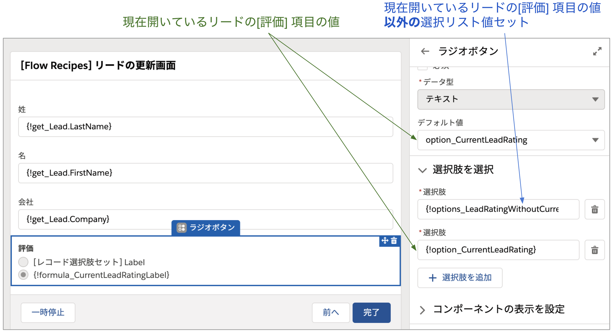

# リードの更新画面

## 使い方
フローを有効化後、リードのクイックアクションを新規作成し、このフローを選択するか、リードの Lightning ページにフローを直接配置して使用することができます。デバッグする場合は `recordId` に任意のリードのレコード Id を入力して試してください。

## ポイント
### レコード Id の取得
現在開いているレコード Id をフロー内で取得するには [入力] にチェックの入った `recordId` という名前のテキスト型の変数を用います。この変数には自動的に現在開いているレコード の Id がセットされます。

### 選択リストのデフォルト値
選択リストやラジオボタンで、現在開いているレコードの選択肢の値をデフォルト値に設定するには少し工夫が必要です。通常、オブジェクトの選択リスト項目を画面フローで使用する場合は、[選択リスト選択肢セット] を使用しますが、これ単独では現在開いているレコードの選択リスト値をデフォルト値として使用することができません。そこで、[レコード選択肢セット] を使用し、`PicklistValueInfo` オブジェクトから、現在開いている値以外の選択リスト値を取得します。加えて、現在開いているレコードの選択リスト値を個別の選択肢として作成し、これらを組み合わせます。

数式 `formula_CurrentLeadRatingLabel` で表現している選択リスト値の表示ラベルは、環境に合わせて修正してください。

