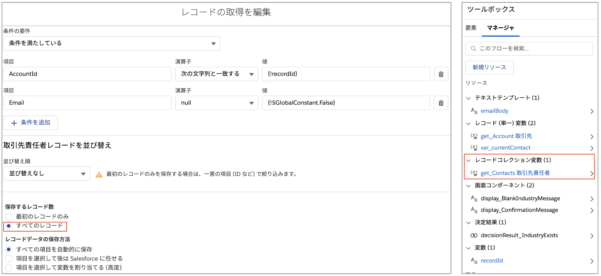
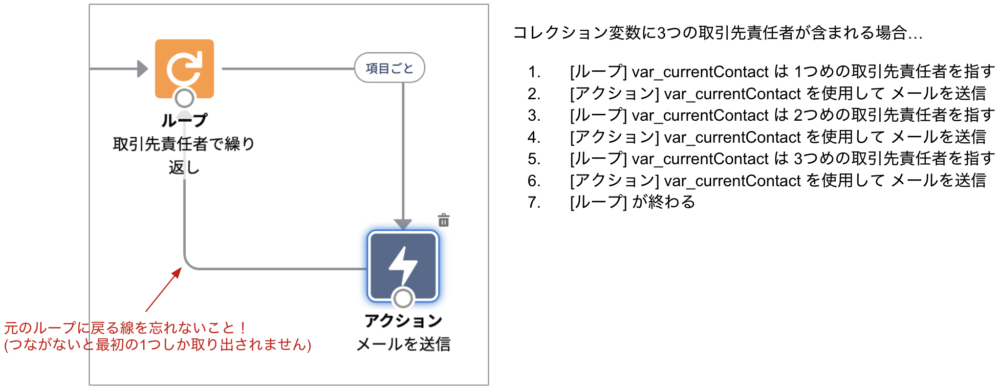

# 取引先から取引先責任者に一括メールを送信する画面
取引先に紐づく取引先責任者に対して固定の一括メールを送信するサンプルのフローです。条件分岐や、コレクション変数、ループの使い方を学べます。

## 使い方
フローを有効化し、このフローを使用して取引先のクイックアクションを新規作成するか、取引先の Lightning ページにフローを配置します。デバッグで起動する場合は `recordId` に取引先のレコード ID を入力してください。

## ポイント
### [決定] 要素
このフローでは、取引先の[業種] に値が設定されているときだけ確認メッセージを表示しメール送信でき、値が設定されていない場合は、メールを送信できない旨のメッセージを表示する画面に遷移します。このように、フロー内で条件分岐を設定する場合には、[決定] 要素を使用します。

[結果] の表示ラベルは、[決定] 要素と他の要素をつなぐ際、線の上に表示されますので、分かりやすい表示ラベルをつけるようにしましょう。

### コレクション変数

コレクション変数は、複数の値を保持することができる変数です。[レコードの取得] 要素で、すべてのレコードを選択した場合、その結果はコレクション変数として保存されます。このフローでは、(1つの) `get_Contacts` コレクション変数内に複数の取引先責任者レコード変数が含まれています。

### ループ
コレクション変数の中身を1つずつ取り出して処理を行いたい場合はループを用います。ループ要素の設定で指定した [ループ変数] には、コレクション変数に含まれる1つの変数を指しています。

### メール送信
フローからメールを送信する場合は、[アクション要素] から [メールを送信] を選択します。詳細は [Salesforce Help - フローコアアクション: メールを送信](https://help.salesforce.com/apex/HTViewHelpDoc?id=flow_ref_elements_actions_sendemail.htm&language=ja) を参照してください。

メール本文はアクションに直接記載するよりも、テキストテンプレートを使用すると良いでしょう。このとき、テキストテンプレートの種別はリッチテキストではなくテキストにします。(リッチテキストだと本文に HTML タグが挿入されてしまうため)

