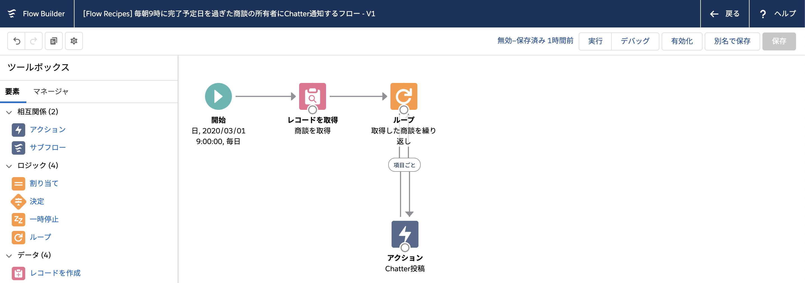
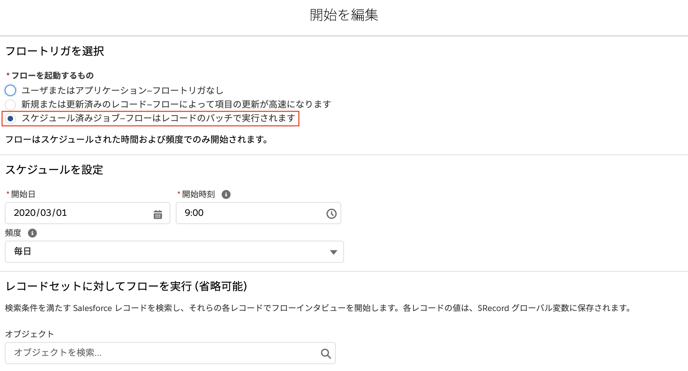
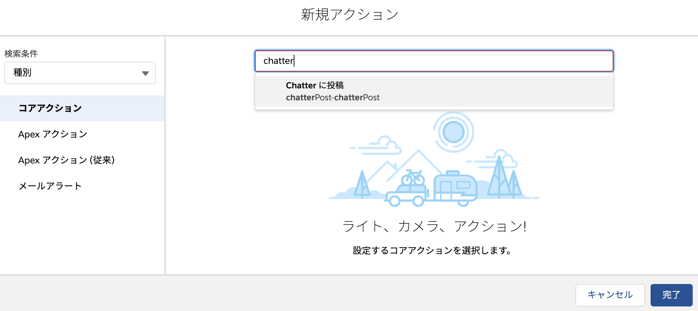
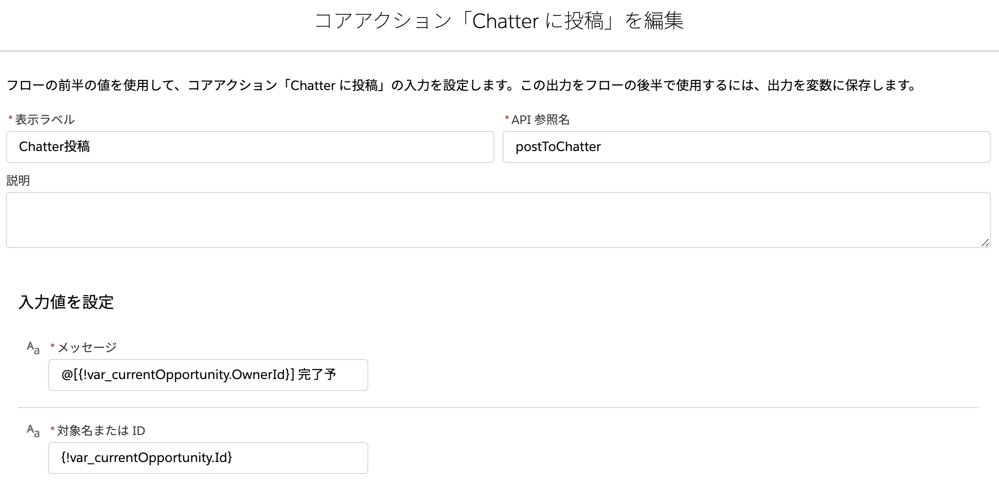

# 毎朝9時に完了予定日を過ぎた商談の所有者に Chatter でメンションするスケジュールフロー

## スケジュール済みフロー

レポートのスケジューリングのように、決まった時間にフローを定期的に実行させるには、スケジュール済みフローを使用します。自動実行フローの開始要素を編集し、[フローを起動するもの] で [スケジュール済みジョブ] を選択します。

スケジュール済みジョブを選択した場合に、開始要素でオブジェクトやレコードを絞り込むことができますが、ここでの条件には変数が使用できません。つまり、今回のように、完了予定日と本日日付を比較したい場合など、動的な条件を使用してレコードを取得する場合は、別途 [レコードの取得] 要素を使用してください。

## Chatter 投稿

フローから Chatter 投稿を行うには、[アクション] 要素で [Chatter に投稿] を選択します。

このアクションの必須項目は、[メッセージ] と [対象名または ID] の2つです。

[メッセージ] は Chatter 投稿の本文です。
メンションする場合は、`@[0051m000000Zw7]` のように記載します。ユーザ ID は ID を直接指定するのではなく、変数にすることもできます。このフローでは、`@[{!var_currentOpportunity.OwnerId}] 完了予定日が過ぎています！` というメッセージを設定して、取得した商談の所有者 (OwnerId) にメンションする設定になっています。メッセージ本文が長くなる場合は、直接入力するのではなく、数式型の変数を作成しメッセージを設定し、このアクションからその変数を参照すると良いでしょう。

[対象名または ID] はどのレコードに対して Chatter 投稿するかを指定します。レコード ID を指定するか、ユーザ名やChatter グループ名を指定することもできます。ユーザ名を設定した場合は、[ターゲット種別] の項目に `User` を設定し、Chatter グループ名を指定した場合は、[ターゲット種別] の項目に `Group` を設定してください。詳細は [Help 記事の フローコアアクション - Chatter に投稿](https://help.salesforce.com/articleView?id=flow_ref_elements_actions_chatter.htm&type=5) を参照してください。