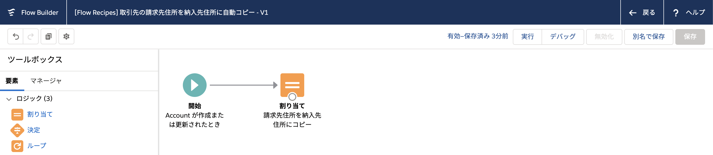
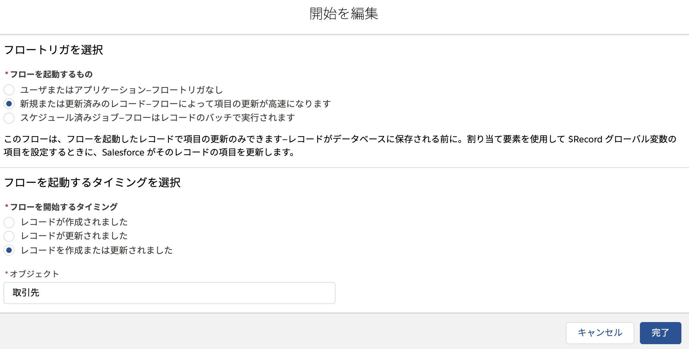

# 取引先の請求先住所を納入先住所に自動コピー

## ポイント
取引先の請求先住所を納入先住所に自動コピーするフローです。

### 保存前フローについて
[Spring '20 で GA となった保存前フロー](https://releasenotes.docs.salesforce.com/ja-jp/spring20/release-notes/rn_forcecom_flow_fbuilder_before_save_updates.htm)はプロセスビルダーと同様に、レコードの作成や更新をきっかけとして起動する自動化プロセスです。プロセスビルダーと比較して処理が高速であることがメリットです。例えば、コンパイルサイズの非常に大きな数式を作成している場合は、このフローに置き換えるとメンテナンスしやすくなる可能性があるでしょう。

保存前フローは、開始要素を編集し、[フローを起動するもの] で [開始または更新済みのレコード] を選択することで利用できます。

#### まだプロセスビルダーを使わないといけない場合
以下のユースケースは保存前フローが非対応のため、プロセスビルダー (またはワークフロールール) で実装する必要があります。
* Chatter投稿、カスタム通知、メールアラート
* 親または子レコードの新規作成・更新
    * 親レコードを取得することは可能のため、親レコードの情報に基づいて現在のレコードを更新することは可能です。
* 呼び出し可能アクション
* プラットフォームイベント

### 保存前フローの基礎
保存前フローでは、対象のレコードが `$Record` 変数で管理されます。レコードを更新する場合は、この変数の項目に値を割り当てます。

### 複合項目の取り扱い

納入先住所や請求先住所は `ShippingAddress`、`BillingAddress` といった項目で管理されますが、これらは複合項目と呼ばれ、**読み取り専用**です。少し手間がかかりますが、値を割り当てる際は、元の項目群 (郵便番号 (`ShippingPostalCode`) や都道府県 (`ShippingState`) など) を個別に扱う必要があります。