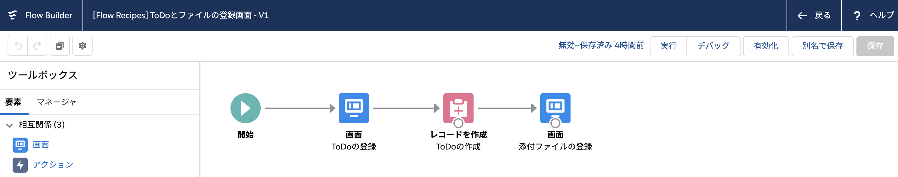
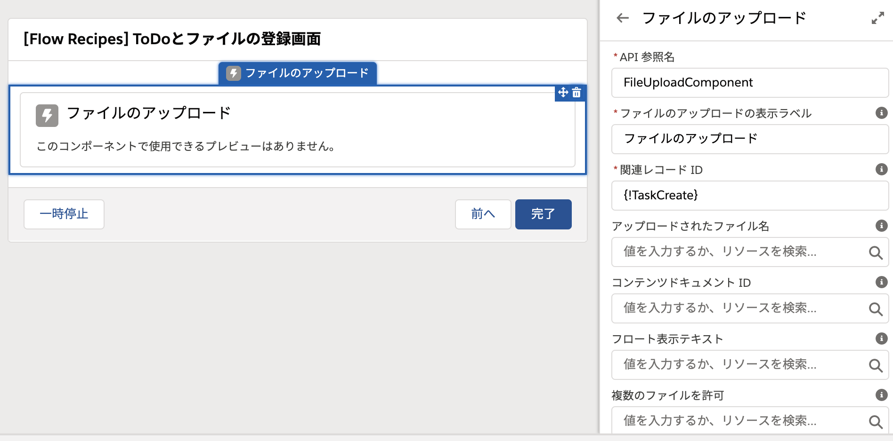

# ToDoとファイルの登録画面
新規 ToDo に続けてファイルをアップロードできる画面フローです。

## ポイント
### ファイルのアップロード

[ファイルのアップロード] 要素では、[関連レコード ID] 欄に、親レコードの ID を設定します。このコンポーネントでは、テキストなど通常の画面入力要素と異なり、[次へ] を押すことなく、コンポーネント上で直接ファイルをアップロードします。そのため、画面を開いた時点で [関連レコード ID] の値が確定していないとファイルのアップロードはできません。つまり、親レコードの作成とファイルのアップロードを同じ画面で行うことはできないことに注意してください。(レコードの更新とファイルのアップロードであれば、画面を開いた時点で親レコードの ID が確定しているので実装可能です。)